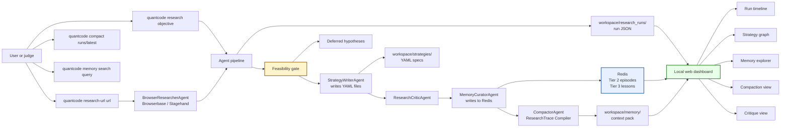
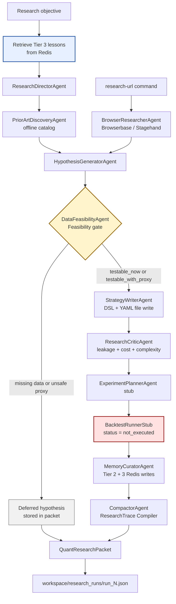
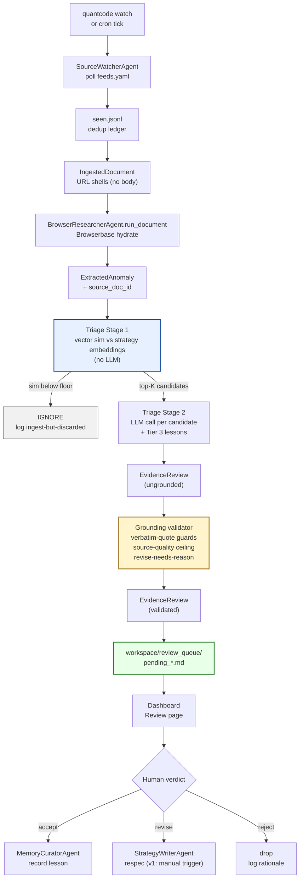
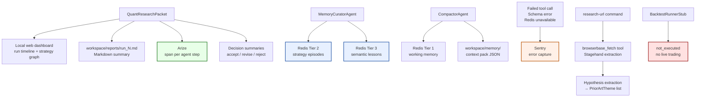
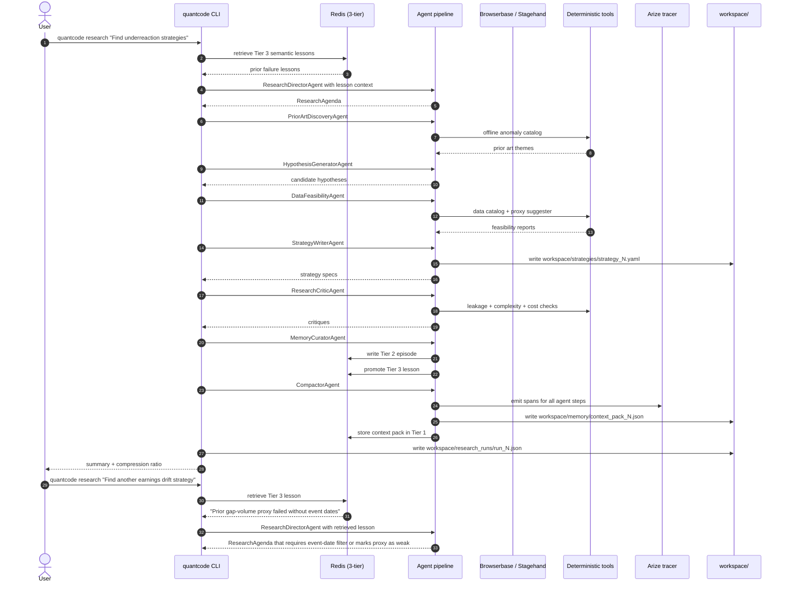
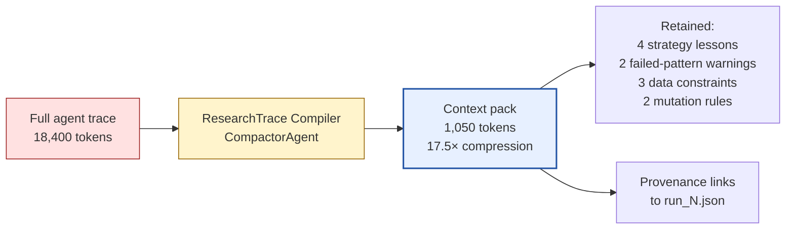

# System Design Diagram

## Presentation Architecture



---

## Core Agent Flow



---

## Watcher Flow (Milestone 6)

Evidence-pushed mode. Runs parallel to the objective-pulled `quantcode research` flow.
The 9-agent pipeline above is unchanged; the watcher wraps it.



---

## Integrations



---

## Demo Runtime Sequence



---

## Compaction Before/After



---

## Hackathon Pitch

Build the demo around one sentence:

> QuantCode is Claude Code for systematic strategy research: a local agent that reads a quant
> workspace, researches market hypotheses, writes strategy specs, critiques them, stores
> outcome-grounded memory in Redis, and compacts long research traces into reusable context.

Four things to show clearly:

1. **Workspace I/O** — agent reads and writes files like a developer tool.
2. **Redis memory across runs** — the agent avoids repeating past failures because it retrieves
   lessons from Tier 3 before generating new hypotheses.
3. **Measurable compaction** — print compression ratio and retained-lesson count after every run.
4. **Safe boundaries** — backtesting is stubbed, broker is disabled, no financial advice is implied.

## What To Show in the 3-Minute Demo

```
1. "This is QuantCode, Claude Code for strategy research."

2. CLI: quantcode research "Find short-horizon equity strategies based on market underreaction."

3. Agent generates:
   - research themes, hypotheses, feasibility reports
   - strategy YAML in workspace/strategies/
   - markdown report in workspace/reports/

4. Dashboard: strategy graph, critique view, memory writes.

5. CLI: quantcode compact runs/latest --budget 1000
   - prints: 18,400 tokens → 1,050 tokens (17.5×)
   - shows Redis Tier 2/3 entries and provenance links

6. CLI: quantcode research "Find another earnings drift strategy."
   - agent retrieves Tier 3 lesson:
     "Prior gap-volume proxy failed without event dates."
   - generates strategy with event-date requirement or explicit proxy warning

7. Close: "The backtester is stubbed today, but the research loop, Redis memory,
           and token compaction layer are implemented."
```
