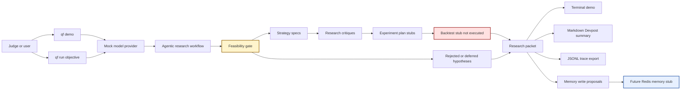
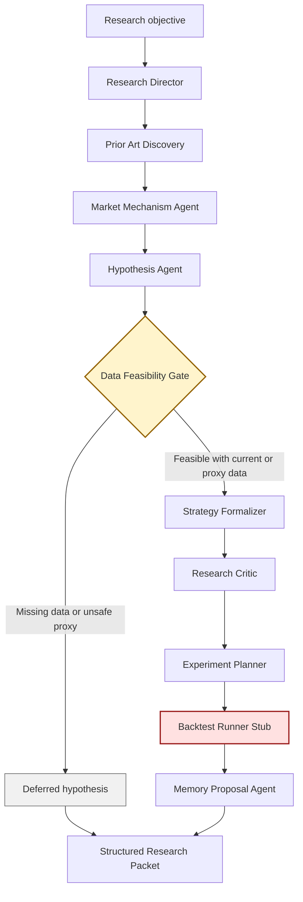
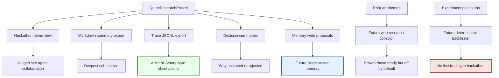
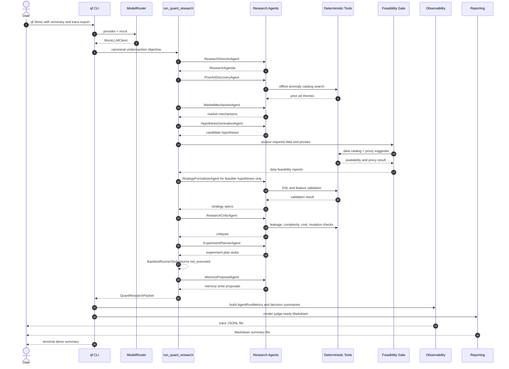

# System Design Diagram

This design shows the target project flow after the package mismatch is fixed. The
recommended repair is to rename `quant_forge/` back to `quant_forge/`, because the
project name, CLI entry point, docs, tests, and existing imports already use that identity.

## Presentation Architecture

This version avoids renderer-fragile Mermaid syntax: no HTML line breaks, no links directly
to subgraphs, no schema labels with square brackets, and no text embedded inside dotted
edges.



## Core Agent Flow



## Integrations We Can Incorporate Safely



## Demo Runtime Flow



## Hackathon Direction

Build the presentation around one sentence:

> Quant Forge turns broad quant research questions into strict, data-aware strategy
> specifications while refusing to run unsafe execution or unproven backtests.

The demo should show four things clearly:

1. **Multi-agent collaboration**: each agent has one job, from research agenda to memory
   proposal.
2. **Feasibility gate**: hypotheses are narrowed before they can become strategy specs.
3. **Observability**: traces and decision summaries explain why ideas passed or failed.
4. **Safe boundaries**: backtesting, Redis memory, web research, data connectors, and broker
   integrations are explicit stubs unless future milestones implement them.

## What To Incorporate Now

| Area | Add Now | Keep Stubbed |
|---|---|---|
| Package identity | Fix import/package mismatch before features | None |
| Demo experience | `qf demo` with polished terminal output | No live provider requirement |
| Devpost output | `--summary-md` / `--devpost-summary` Markdown export | No generated performance claims |
| Observability | JSONL trace export, validation counts, decision summaries | External SaaS integrations |
| Redis fit | `RedisMemoryStoreStub` interface and docs | No Redis dependency or network |
| Multi-agent framing | `docs/hackathon_pitch.md` and visible agent collaboration diagram | No unnecessary agent orchestration platform |
| Browserbase fit | `WebResearchCollectorStub` future interface | No live scraping in default mode |
| Backtesting | Preserve `BacktestRunnerStub(status="not_executed")` | Real backtester |
| Broker/data | Keep explicit stubs | Broker integration, live market data |

## Proposed File Additions

```text
quant_forge/
  demo.py
  reporting/
    __init__.py
    demo_summary.py
    markdown.py
  observability/
    __init__.py
    schemas.py
    trace_export.py
    summaries.py
  future/
    redis_memory.py
    web_research.py

docs/
  system_design_diagram.md
  hackathon_pitch.md
  redis_memory_design.md
  observability.md
```

If the project chooses `quant_forge` as the final package name instead, use the same structure
under `quant_forge/` and update `pyproject.toml`, tests, imports, docs, and CLI entrypoints in
one mechanical pass.

## Acceptance Path

1. Fix the package mismatch and reinstall editable mode.
2. Verify the existing workflow still passes.
3. Add demo and reporting modules.
4. Add observability models and JSONL export.
5. Add Redis and web-research stubs.
6. Add hackathon pitch docs.
7. Run:

```bash
pytest
ruff check .
mypy quant_forge
qf demo
qf demo --summary-md demo.md --trace-jsonl traces.jsonl
```

The final pitch remains: a safe agentic research layer that reasons broadly, narrows ideas
through feasibility gates, emits strict strategy specifications, and refuses to imply live
execution or proven profitability.
