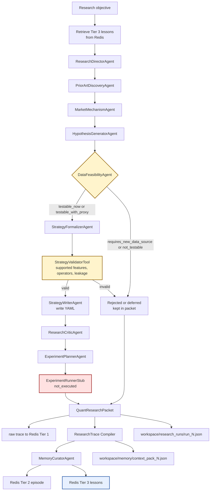
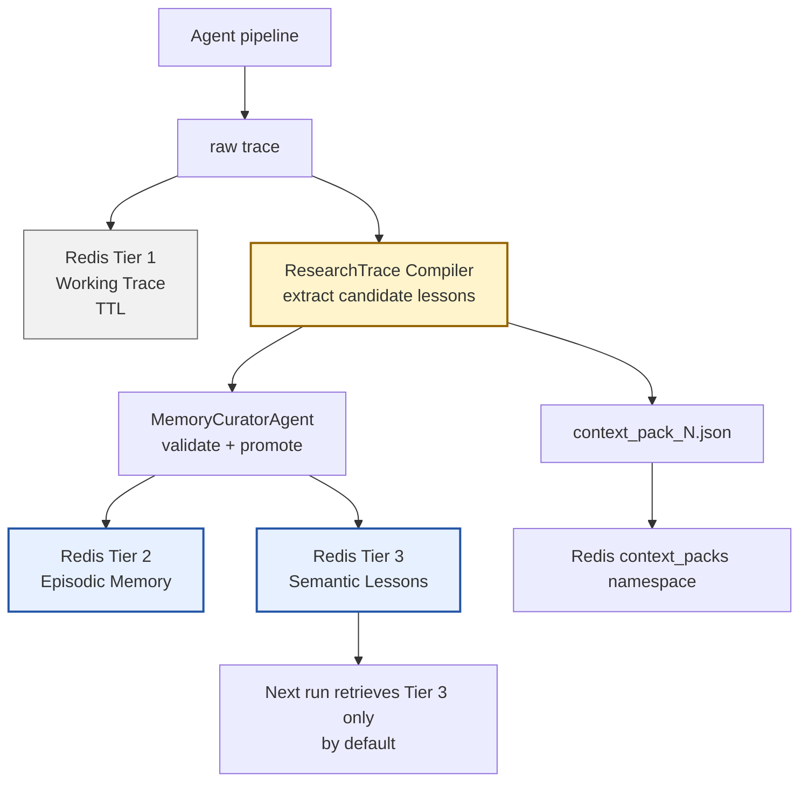
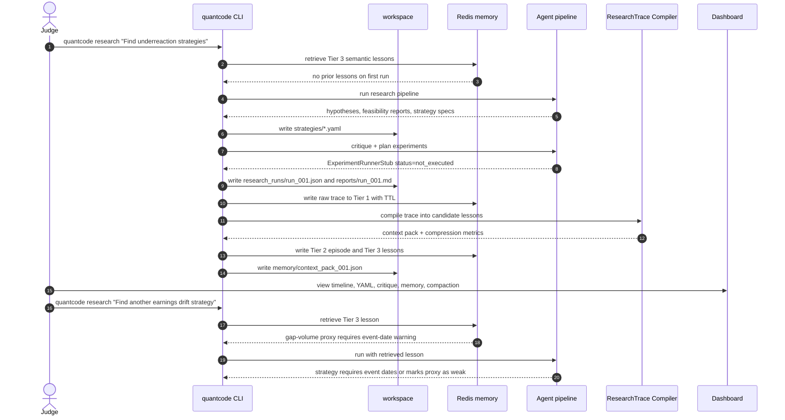

# System Design Diagram

This is the target architecture for **QuantCode** after the package naming is standardized.
The product should be CLI-first with workspace artifacts as the source of truth. A dashboard is
only a judge-facing viewer over files and memory.

## Product Flow

```mermaid
flowchart LR
    U["User or judge"] --> CLI["quantcode CLI"]
    CLI --> R["research objective"]
    CLI --> URL["research-url URL\noptional"]
    CLI --> C["compact run"]
    CLI --> M["memory search"]

    R --> L3["Retrieve Tier 3\nsemantic lessons"]
    L3 --> A["Agent research pipeline"]
    URL --> BR["BrowserResearcherAgent\nBrowserbase-ready"]
    BR --> PA["PriorArtTheme"]
    PA --> A

    A --> G{"Feasibility gate"}
    G -->|testable| V["StrategyValidatorTool"]
    G -->|blocked| D["Deferred hypotheses"]
    V --> W["StrategyWriterAgent"]
    W --> WS["workspace/strategies/*.yaml"]

    W --> CR["ResearchCriticAgent"]
    CR --> EP["ExperimentPlannerAgent"]
    EP --> ER["ExperimentRunnerStub\nstatus: not_executed"]

    ER --> P["QuantResearchPacket"]
    D --> P
    P --> RUN["workspace/research_runs/run_N.json"]
    P --> REP["workspace/reports/run_N.md"]
    P --> TRACE["raw agent trace"]

    TRACE --> T1["Redis Tier 1\nworking trace TTL"]
    TRACE --> RTC["ResearchTrace Compiler\nCompactorAgent"]
    RTC --> CP["workspace/memory/context_pack_N.json"]
    RTC --> MC["MemoryCuratorAgent"]
    MC --> T2["Redis Tier 2\nepisode"]
    MC --> T3["Redis Tier 3\nsemantic lessons"]

    RUN --> DASH["local dashboard\nread-only"]
    REP --> DASH
    CP --> DASH
    T2 --> DASH
    T3 --> DASH

    style G fill:#fff4cc,stroke:#946200,stroke-width:2px
    style ER fill:#ffe1e1,stroke:#9b1c1c,stroke-width:2px
    style T3 fill:#e7f0ff,stroke:#2455a6,stroke-width:2px
    style WS fill:#e8ffe8,stroke:#247a24,stroke-width:2px
```



## Core Agent Flow



## Workspace Artifacts

```text
workspace/
  strategies/
    earnings_gap_volume_drift.yaml
  research_runs/
    run_001.json
  memory/
    context_pack_001.json
  reports/
    run_001.md
```

`WorkspaceManager` should own all file I/O:

- `write_strategy_yaml`
- `write_run_json`
- `write_markdown_report`
- `write_context_pack`
- `read_existing_strategies`
- `list_workspace`

This makes QuantCode feel like a local coding agent rather than a chat-only pipeline.

## Redis Memory Path



Suggested Redis keys:

```text
qc:run:{run_id}:trace       # Tier 1, TTL
qc:episode:{run_id}         # Tier 2
qc:lesson:{lesson_id}       # Tier 3
qc:context_pack:{pack_id}   # compacted retrieval object
qc:index:lessons            # vector/search index
```

Tier definitions:

- **Tier 1: Working Trace** — short-lived run/session data: raw events, tool calls,
  intermediate outputs, and trace chunks. This should expire.
- **Tier 2: Episodic Memory** — one record per research run or strategy episode: objective,
  generated specs, critiques, failed feasibility assumptions, and provenance.
- **Tier 3: Semantic Lessons** — compact durable lessons: reusable warnings, successful
  patterns, data constraints, and mutation rules. Retrieved before new runs.

The second-run demo should prove that Tier 3 retrieval changes behavior. Do not claim empirical
strategy failures until real backtesting exists. Say the agent avoids repeating previously
critiqued feasibility and validation mistakes.

## Demo Runtime Sequence



## Dashboard Panels

Keep the dashboard read-only. The CLI and workspace are the product; the dashboard is for judge
comprehension.

Minimum panels:

- Agent timeline
- Strategy YAML viewer
- Critique view
- Redis memory explorer
- Compaction before/after
- Follow-up run comparison

The follow-up comparison is the strongest demo surface:

```text
Run 1: generated weak gap-volume proxy
Memory: stored feasibility/validation warning
Run 2: retrieved warning and changed strategy requirements
```

## Hackathon Pitch

> QuantCode is Claude Code for systematic strategy research: a local agent that reads a quant
> workspace, researches market hypotheses, writes strategy specs, critiques feasibility and
> leakage, stores research memory in Redis, and compacts long traces into reusable context.

Do not use “outcome-grounded memory” until real experiment outcomes or backtests exist.
Use “research memory,” “critique-grounded memory,” or “feasibility-grounded memory” for this version.

## Build Priority

1. CLI
2. Workspace artifacts
3. Redis memory
4. Compaction
5. Second-run memory retrieval demo
6. Minimal read-only dashboard
7. Browserbase `research-url`
8. Arize/Sentry observability

Cut first if time gets tight:

- Deepgram
- Band
- Orkes
- full desktop app
- broker or paper trading
- real backtester
- complex market data ingestion
- multi-page frontend

